# Media Plan to Raw Data Automation - Complete Workflow

## Executive Overview

This diagram shows the complete automated workflow that transforms media planning data into standardized output reports with 100% accuracy validation.

```mermaid
flowchart TB
    classDef inputFile fill:#e1f5fe,stroke:#01579b,stroke-width:2px,color:#000000
    classDef processStep fill:#c8e6c9,stroke:#2e7d32,stroke-width:2px,color:#000000
    classDef validation fill:#fff3cd,stroke:#f57c00,stroke-width:2px,color:#000000
    classDef output fill:#d1c4e9,stroke:#512da8,stroke-width:2px,color:#000000
    classDef error fill:#ffcdd2,stroke:#d32f2f,stroke-width:2px,color:#000000
    classDef success fill:#a5d6a7,stroke:#388e3c,stroke-width:3px,color:#000000

    subgraph INPUT["📁 INPUT DATA"]
        P["PLANNED Excel<br/>Media Plan Template<br/>79 rows"]:::inputFile
        D["DELIVERED Excel<br/>PCA Sensodyne Data<br/>156 rows"]:::inputFile
        T["OUTPUT Template<br/>Empty Structure<br/>36 columns"]:::inputFile
    end

    subgraph CONFIG["⚙️ CONFIGURATION"]
        CF["config.json<br/>• Platform aliases<br/>• Country codes<br/>• Business rules"]:::inputFile
        CS["JSON Schema<br/>Validation Rules"]:::inputFile
    end

    subgraph STEP1["STEP 1: DATA EXTRACTION"]
        E["excel_data_extractor.py"]:::processStep
        E1["Extract PLANNED Data<br/>• Budget info<br/>• Campaign details<br/>• Market data"]:::processStep
        E2["Extract DELIVERED Data<br/>• Actual spend<br/>• Performance metrics<br/>• R&F data"]:::processStep
        RM["Robust Market Mapper<br/>• Handle missing campaigns<br/>• Match markets<br/>• Edge cases"]:::processStep
        E3["COMBINED Output<br/>235 total rows<br/>All campaigns included"]:::output
    end

    subgraph STEP2["STEP 2: BUSINESS RULE VALIDATION"]
        V1["verify_combined.py<br/>Business Rule Validator"]:::validation
        BR["Check Business Rules<br/>• Budget from PLANNED<br/>• Spend from DELIVERED<br/>• Calculations correct"]:::validation
        V1R{"Valid?"}
        ERR1["❌ Stop Pipeline<br/>Fix data issues"]:::error
        NEXT1["✅ Continue"]:::success
    end

    subgraph STEP3["STEP 3: TEMPLATE MAPPING"]
        LM["simple_llm_mapper.py<br/>Intelligent Mapper"]:::processStep
        LM1["Load Template Structure<br/>• Read headers<br/>• Identify sections"]:::processStep
        LM2["Map Data Columns<br/>• 36/36 coverage<br/>• Smart matching<br/>• Claude API backup"]:::processStep
        LM3["Apply Formatting<br/>• Roboto 9 font<br/>• Country codes OMN JOR<br/>• Market ordering"]:::processStep
        LM4["Write Context Section<br/>• Campaign insights<br/>• Platform summary<br/>• Quality metrics"]:::processStep
        FM["Final Mapped Output<br/>864 cells written<br/>100% coverage"]:::output
    end

    subgraph STEP4["STEP 4: ACCURACY VALIDATION"]
        AV["data_accuracy_validator.py<br/>Multi-Level Validator"]:::validation
        AV1["Cell Level Check<br/>• SHA-256 fingerprints<br/>• Value comparison"]:::validation
        AV2["Row Level Check<br/>• Row totals<br/>• Data integrity"]:::validation
        AV3["Section Level Check<br/>• Platform totals<br/>• Market totals"]:::validation
        AV4["Grand Total Check<br/>• Overall accuracy<br/>• 0.1% tolerance"]:::validation
        AVR{"100% Accurate?"}
        ERR2["❌ Stop Pipeline<br/>Generate diff report<br/>Exit code 1"]:::error
        NEXT2["✅ Continue"]:::success
    end

    subgraph OUTPUTS["📊 FINAL OUTPUTS"]
        O1["Excel Output<br/>• Filled template<br/>• All metrics mapped<br/>• Professional formatting"]:::output
        O2["Validation Reports<br/>• UAT summary<br/>• Diff reports CSV<br/>• Audit trails"]:::output
        O3["Performance Metrics<br/>• Processing time<br/>• Coverage stats<br/>• Success rate"]:::output
    end

    subgraph ERRORHANDLING["🛡️ ERROR HANDLING"]
        EH["Production Error Handler<br/>• Comprehensive logging<br/>• Graceful failures<br/>• Clear error messages"]:::validation
        PM["Performance Monitor<br/>• Progress tracking<br/>• Memory usage<br/>• Timing metrics"]:::validation
    end

    SUCCESS["✅ PRODUCTION READY"]:::success

    P --> E
    D --> E
    CF --> E
    E --> E1
    E --> E2
    E1 --> RM
    E2 --> RM
    RM --> E3
    E3 --> V1
    V1 --> BR
    BR --> V1R
    V1R -->|No| ERR1
    V1R -->|Yes| NEXT1
    NEXT1 --> LM
    T --> LM
    LM --> LM1
    LM1 --> LM2
    LM2 --> LM3
    LM3 --> LM4
    LM4 --> FM
    FM --> AV
    E3 --> AV
    AV --> AV1
    AV1 --> AV2
    AV2 --> AV3
    AV3 --> AV4
    AV4 --> AVR
    AVR -->|No| ERR2
    AVR -->|Yes| NEXT2
    NEXT2 --> O1
    NEXT2 --> O2
    NEXT2 --> O3
    O1 --> SUCCESS
    O2 --> SUCCESS
    O3 --> SUCCESS
    E -.-> EH
    LM -.-> EH
    AV -.-> EH
    E -.-> PM
    LM -.-> PM
```

## Key Features for Management

### 🎯 **100% Automation**
- No manual intervention required
- Automatic error detection and reporting
- Self-validating at every step

### 📊 **Complete Data Coverage**
- All 36 columns mapped automatically
- Handles edge cases (missing campaigns, zero values)
- R&F data processed separately with special logic

### ✅ **Quality Assurance**
- Multi-level validation (cell, row, section, total)
- Business rule enforcement
- Fail-fast mechanism stops bad data early

### 🚀 **Performance**
- Complete workflow: ~4.35 seconds
- Progress tracking throughout
- Optimized for large datasets

### 📈 **Reporting**
- Executive summaries
- Detailed audit trails
- CSV diff reports for any discrepancies

## Process Flow Summary

1. **Input**: PLANNED and DELIVERED Excel files
2. **Extract**: Combine data with intelligent market mapping
3. **Validate**: Check business rules are followed
4. **Map**: Transform to output template format
5. **Verify**: Ensure 100% accuracy
6. **Output**: Professional reports ready for distribution

## Benefits

- **Time Savings**: Hours of manual work reduced to seconds
- **Accuracy**: Eliminates human error with automated validation
- **Scalability**: Handles any volume of data
- **Auditability**: Complete trail of all transformations
- **Reliability**: Comprehensive error handling prevents bad outputs